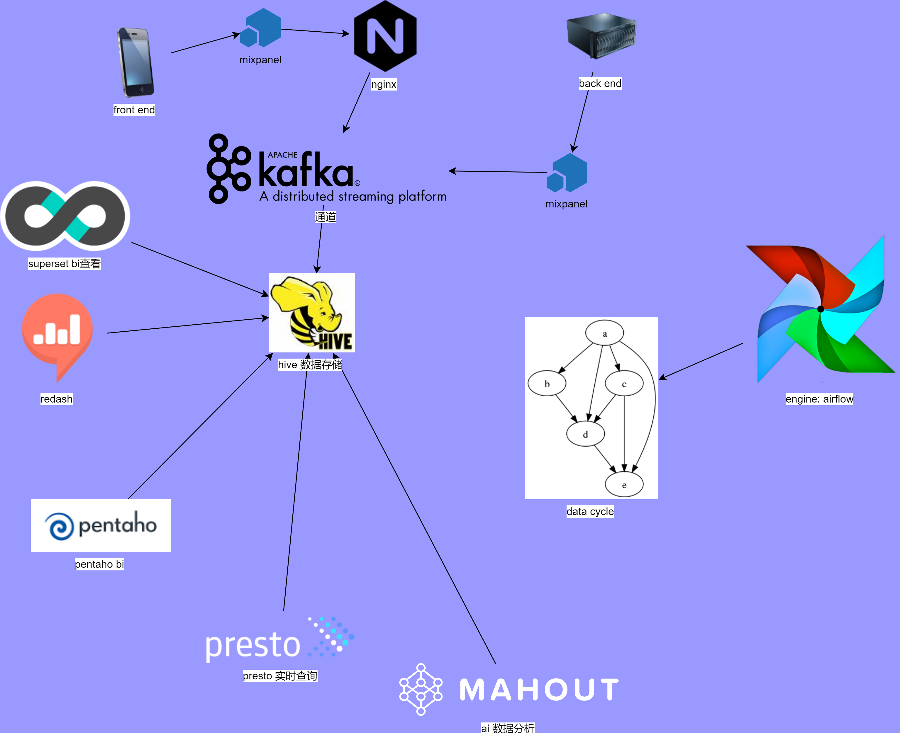

<div align=center></div>
# b3.dd

data driven


## design



### 详细设计

[设计](./detailDesign/main.md)

## just do it 

[从零开始](./fromZero.md) 做dd

1. bury first

2. [install kafka](https://github.com/apporoad/eploy/blob/master/docs/kafka.md)   test using [kafka tool](http://www.kafkatool.com/)

3. install [hive](https://github.com/hyd-raiders/b2.xdo)

4. install  nginx with [kafka module](https://github.com/brg-liuwei/ngx_kafka_module)

   [detail](./docs/nginx.md)
   
4. 测试
   
```bash
#开启consumer
#/root/app/kafka_2.11-0.8.2.2/bin/kafka-console-consumer.sh --zookeeper zk-02:2181,zk-01:2181,zk-03:2181 --topic track --from-beginning

/opt/kafka_2.12-2.3.0/bin/kafka-console-consumer.sh --bootstrap-server localhost:9092 --topic bury --from-beginning

# 浏览器测试 http://xxxxxxxxxxxx/bury/get?p=1

# try http://xxxxxxxxxxxxxxx:8123/track/?data=eyJldmVudCI6ICJ4eHgiLCJwcm9wZXJ0aWVzIjogeyIkb3MiOiAiV2luZG93cyIsIiRicm93c2VyIjogIkNocm9tZSIsIiRjdXJyZW50X3VybCI6ICJodHRwOi8vbG9jYWxob3N0OjgxMjMvaG9tZSIsIiRicm93c2VyX3ZlcnNpb24iOiA3MiwiJHNjcmVlbl9oZWlnaHQiOiA4NjQsIiRzY3JlZW5fd2lkdGgiOiAxNTM2LCJtcF9saWIiOiAid2ViIiwiJGxpYl92ZXJzaW9uIjogIjIuMjkuMSIsInRpbWUiOiAxNTcxODE2NDQwLjY1OCwiZGlzdGluY3RfaWQiOiAiMTZkZjM4YjYyNzg4MjAtMDYwMTI0ZjZlOThlNjItNTdiMTUzZC0xNDQwMDAtMTZkZjM4YjYyNzk3YzIiLCIkZGV2aWNlX2lkIjogIjE2ZGYzOGI2Mjc4ODIwLTA2MDEyNGY2ZTk4ZTYyLTU3YjE1M2QtMTQ0MDAwLTE2ZGYzOGI2Mjc5N2MyIiwiJGluaXRpYWxfcmVmZXJyZXIiOiAiaHR0cDovL2xvY2FsaG9zdDo4MTIzL2hvbWUiLCIkaW5pdGlhbF9yZWZlcnJpbmdfZG9tYWluIjogImxvY2FsaG9zdDo4MTIzIiwiaGVsbG8iOiAid29ybGQiLCJ0b2tlbiI6ICJ4eHh4In19&ip=1&_=1571816440658
```
   5. spark部署及开发

      [开发](./subs/spark.dev.md)
   
   6.  install  [granfana](https://grafana.com/grafana/download?platform=docker) @docker
```bash
docker run -d -p 3001:3000 grafana/grafana
```

   7. install [graphite](https://graphite.readthedocs.io/en/latest/install.html) @docker
```bash
docker run -d \
 --name graphite \
 --restart=always \
 -p 1080:80 \
 -p 2003-2004:2003-2004 \
 -p 2023-2024:2023-2024 \
 -p 8125:8125/udp \
 -p 8126:8126 \
 graphiteapp/graphite-statsd
```

